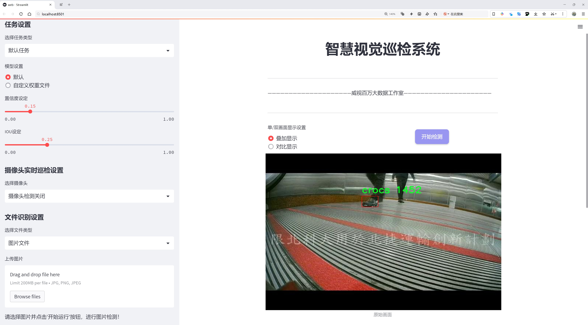
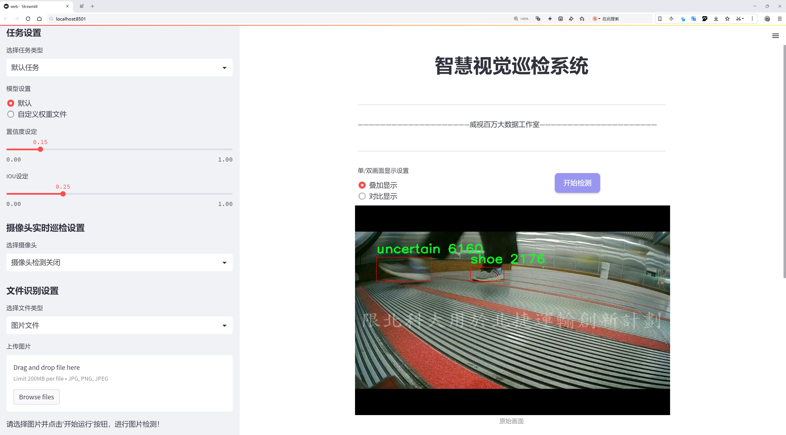
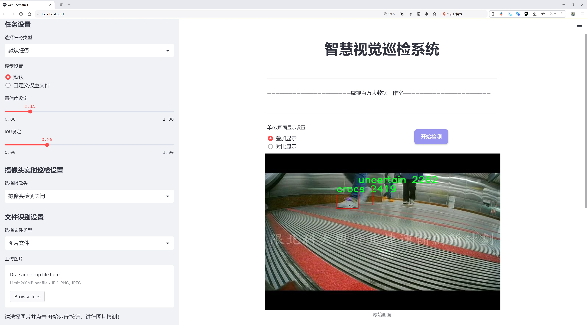
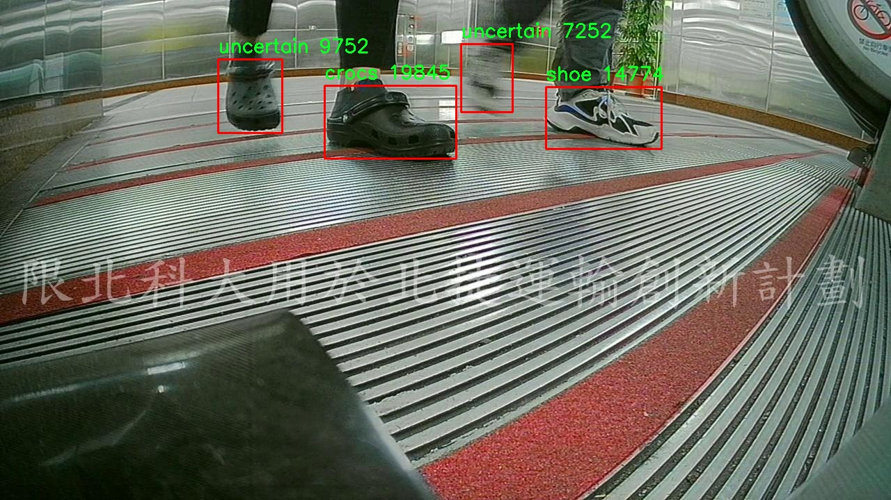
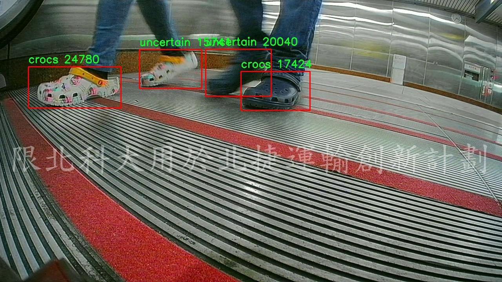
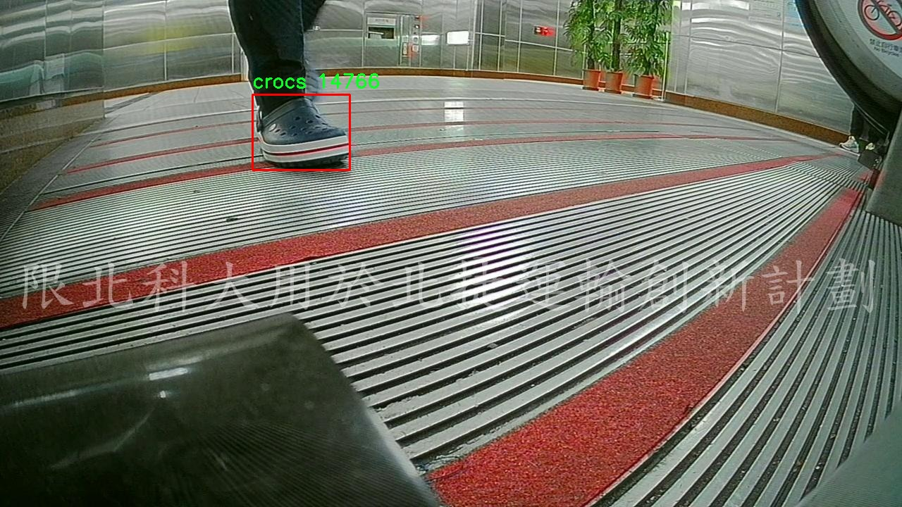
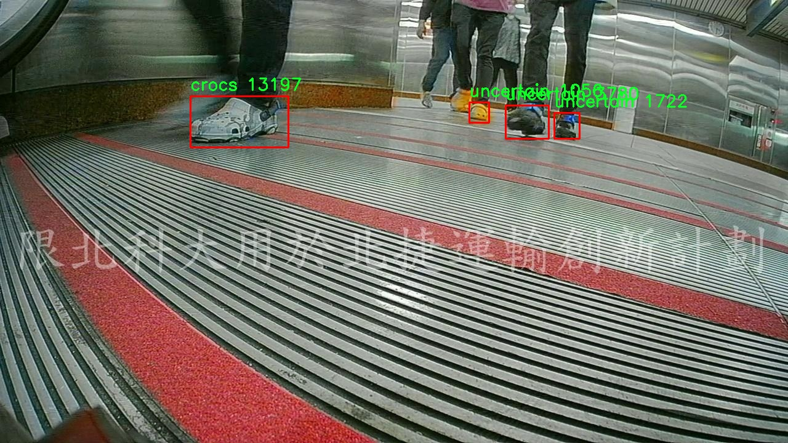
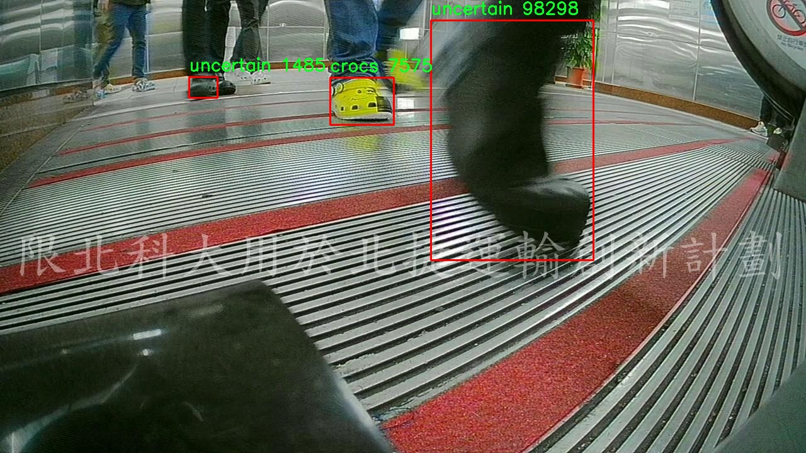

# 监控鞋类物品检测检测系统源码分享
 # [一条龙教学YOLOV8标注好的数据集一键训练_70+全套改进创新点发刊_Web前端展示]

### 1.研究背景与意义

项目参考[AAAI Association for the Advancement of Artificial Intelligence](https://gitee.com/qunmasj/projects)

项目来源[AACV Association for the Advancement of Computer Vision](https://kdocs.cn/l/cszuIiCKVNis)

研究背景与意义

随着人工智能技术的迅猛发展，计算机视觉领域的研究逐渐成为各行业关注的焦点。在众多计算机视觉任务中，物体检测作为一项基础且重要的技术，广泛应用于安防监控、智能交通、无人驾驶等场景。尤其是在零售和公共场所的监控系统中，实时、准确地识别和分类物品，能够有效提升管理效率和安全性。鞋类物品的检测，作为物体检测的一部分，尤其在时尚零售、消费者行为分析等领域具有重要的应用价值。

本研究旨在基于改进的YOLOv8（You Only Look Once Version 8）算法，构建一个高效的监控鞋类物品检测系统。YOLO系列算法以其高效的实时检测能力和较高的准确率，成为物体检测领域的佼佼者。YOLOv8作为最新版本，进一步优化了模型结构和训练策略，能够在复杂环境中实现更高的检测精度和速度。然而，针对特定类别（如鞋类物品）的检测，仍然面临着诸多挑战，如物体的多样性、遮挡问题以及背景复杂性等。因此，改进YOLOv8以适应鞋类物品的检测需求，具有重要的研究意义。

在本研究中，我们将使用包含8700张图像的数据集，涵盖五个类别：crocs、high_heel、long_skirt、shoe和uncertain。这些类别不仅反映了鞋类物品的多样性，还包括了一些不确定的物品，增加了检测的复杂性。通过对这些图像的深入分析与处理，我们希望能够训练出一个在实际应用中表现优异的检测模型。此外，数据集中“uncertain”类别的设置，将使得模型在面对不确定物品时，能够做出更为合理的判断，从而提升系统的鲁棒性。

研究的意义不仅体现在技术层面，更在于其广泛的应用前景。通过构建高效的监控鞋类物品检测系统，商家可以实时监控店内顾客的行为，分析顾客偏好，从而优化商品布局和促销策略，提高销售额。同时，在公共场所的监控中，该系统能够帮助安保人员快速识别潜在的安全隐患，提升公共安全管理的效率。此外，该系统的研究成果也将为后续的物体检测技术发展提供有益的参考，推动计算机视觉技术在更多领域的应用。

综上所述，基于改进YOLOv8的监控鞋类物品检测系统的研究，不仅具备重要的学术价值，还将为实际应用提供强有力的技术支持。通过深入探讨鞋类物品的检测方法，我们期望为物体检测领域的进一步发展贡献新的思路和方法，推动智能监控技术的进步与普及。

### 2.图片演示







##### 注意：由于此博客编辑较早，上面“2.图片演示”和“3.视频演示”展示的系统图片或者视频可能为老版本，新版本在老版本的基础上升级如下：（实际效果以升级的新版本为准）

  （1）适配了YOLOV8的“目标检测”模型和“实例分割”模型，通过加载相应的权重（.pt）文件即可自适应加载模型。

  （2）支持“图片识别”、“视频识别”、“摄像头实时识别”三种识别模式。

  （3）支持“图片识别”、“视频识别”、“摄像头实时识别”三种识别结果保存导出，解决手动导出（容易卡顿出现爆内存）存在的问题，识别完自动保存结果并导出到tempDir中。

  （4）支持Web前端系统中的标题、背景图等自定义修改，后面提供修改教程。

  另外本项目提供训练的数据集和训练教程,暂不提供权重文件（best.pt）,需要您按照教程进行训练后实现图片演示和Web前端界面演示的效果。

### 3.视频演示

[3.1 视频演示](https://www.bilibili.com/video/BV1otxLeFEN5/)

### 4.数据集信息展示

##### 4.1 本项目数据集详细数据（类别数＆类别名）

nc: 5
names: ['crocs', 'high_heel', 'long_skirt', 'shoe', 'uncertain']


##### 4.2 本项目数据集信息介绍

数据集信息展示

在本研究中，我们采用了名为“Total”的数据集，以支持对YOLOv8模型的改进，专注于监控鞋类物品的检测系统。该数据集的设计旨在涵盖多种鞋类及相关物品，确保模型在实际应用中的准确性和鲁棒性。数据集的类别数量为五个，具体类别包括：crocs（洞洞鞋）、high_heel（高跟鞋）、long_skirt（长裙）、shoe（普通鞋）以及uncertain（不确定物品）。这些类别的选择不仅反映了鞋类物品的多样性，还考虑到了在实际监控场景中可能遇到的各种情况。

首先，crocs作为一种流行的休闲鞋，其独特的设计和广泛的使用场景使其成为监控检测的重要对象。数据集中包含的crocs图像将帮助模型学习识别这种鞋类的特征，从而在监控系统中准确定位和分类。此外，高跟鞋作为女性时尚的代表，其形状和轮廓的复杂性为检测带来了挑战。通过对高跟鞋的多样化样本进行训练，模型将能够更好地应对不同款式和颜色的高跟鞋，从而提升整体检测性能。

长裙作为一种服装类别的引入，虽然不是鞋类物品，但在监控场景中，长裙可能与鞋类物品同时出现，因此将其纳入数据集可以帮助模型更好地理解上下文，减少误报和漏报的情况。普通鞋的类别则是最基础的鞋类物品，涵盖了多种类型的运动鞋、休闲鞋等，确保模型能够在最常见的鞋类检测中表现出色。

值得注意的是，uncertain类别的设置则为模型提供了一个重要的学习机会。该类别用于标识那些难以明确分类的物品，这在实际监控中是一个常见问题。通过引入uncertain类别，模型能够学习如何处理不确定性，从而在面对模糊或不清晰的图像时，做出更为合理的判断。这种设计不仅提高了模型的灵活性，也增强了其在复杂环境下的适应能力。

数据集“Total”的构建过程也考虑到了数据的多样性和代表性。每个类别的样本均经过精心挑选，确保涵盖不同的拍摄角度、光照条件和背景环境。这种多样性使得模型在训练过程中能够接触到更广泛的场景，从而提升其在实际应用中的泛化能力。此外，数据集中的图像质量也经过严格把关，以确保模型能够提取到清晰的特征信息。

总之，数据集“Total”不仅为改进YOLOv8的监控鞋类物品检测系统提供了坚实的基础，也为未来的研究和应用奠定了良好的数据支持。通过对五个类别的深入学习和训练，模型将能够在复杂的监控环境中实现高效、准确的鞋类物品检测，为相关领域的应用提供有力的技术支持。











### 5.全套项目环境部署视频教程（零基础手把手教学）

[5.1 环境部署教程链接（零基础手把手教学）](https://www.ixigua.com/7404473917358506534?logTag=c807d0cbc21c0ef59de5)


[5.2 安装Python虚拟环境创建和依赖库安装视频教程链接（零基础手把手教学）](https://www.ixigua.com/7404474678003106304?logTag=1f1041108cd1f708b01a)

### 6.手把手YOLOV8训练视频教程（零基础小白有手就能学会）

[6.1 手把手YOLOV8训练视频教程（零基础小白有手就能学会）](https://www.ixigua.com/7404477157818401292?logTag=d31a2dfd1983c9668658)

### 7.70+种全套YOLOV8创新点代码加载调参视频教程（一键加载写好的改进模型的配置文件）

[7.1 70+种全套YOLOV8创新点代码加载调参视频教程（一键加载写好的改进模型的配置文件）](https://www.ixigua.com/7404478314661806627?logTag=29066f8288e3f4eea3a4)

### 8.70+种全套YOLOV8创新点原理讲解（非科班也可以轻松写刊发刊，V10版本正在科研待更新）

由于篇幅限制，每个创新点的具体原理讲解就不一一展开，具体见下列网址中的创新点对应子项目的技术原理博客网址【Blog】：


[8.1 70+种全套YOLOV8创新点原理讲解链接](https://gitee.com/qunmasj/good)

### 9.系统功能展示（检测对象为举例，实际内容以本项目数据集为准）

图9.1.系统支持检测结果表格显示

  图9.2.系统支持置信度和IOU阈值手动调节

  图9.3.系统支持自定义加载权重文件best.pt(需要你通过步骤5中训练获得)

  图9.4.系统支持摄像头实时识别

  图9.5.系统支持图片识别

  图9.6.系统支持视频识别

  图9.7.系统支持识别结果文件自动保存

  图9.8.系统支持Excel导出检测结果数据


### 10.原始YOLOV8算法原理

原始YOLOv8算法原理

YOLOv8算法是YOLO系列目标检测模型的最新版本，代表了单阶段检测算法的一个重要进步。该算法不仅在检测精度上取得了显著提升，同时在检测速度方面也表现出色。YOLOv8的设计理念旨在实现高效的目标检测，适应各种应用场景，成为计算机视觉领域中的一项重要工具。

YOLOv8的网络结构主要由四个部分组成：输入层、Backbone骨干网络、Neck特征融合网络和Head检测模块。输入层负责对输入图像进行预处理，包括图像比例调整、Mosaic增强以及瞄点计算等。这些预处理步骤旨在增强模型对不同输入条件的适应能力，提高后续特征提取和目标检测的效果。

在Backbone部分，YOLOv8采用了CSPDarknet结构，进一步优化了特征提取的效率。相较于前代模型，YOLOv8用C2f模块替换了C3模块，C2f模块通过将输入特征图分为两个分支并进行卷积处理，能够更好地捕捉到丰富的梯度流信息。这种设计不仅保留了模型的轻量级特性，还增强了特征表示能力，使得模型在处理复杂场景时表现得更加出色。此外，YOLOv8还引入了快速空间金字塔池化（SPPF）模块，通过不同内核尺寸的池化操作，有效地合并了特征图，进一步提升了特征提取的效率。

Neck部分则采用了双塔结构，将特征金字塔网络（FPN）与路径聚合网络（PAN）相结合。这种结构的设计使得网络能够更好地融合不同尺度的特征，促进语义信息与定位信息的有效转移。通过这种特征融合，YOLOv8能够在不同尺度的目标检测中表现出更强的能力，尤其是在处理小目标和大目标时，能够有效提高检测的准确性。

在Head检测模块中，YOLOv8采用了解耦头的结构，将回归分支和预测分支分离。这一设计使得模型的训练过程更加高效，加速了模型的收敛。YOLOv8的检测模块包含三个Detect检测器，能够同时处理多个目标的检测任务。通过无锚框（Anchor-Free）检测方式，YOLOv8直接预测目标的中心点及其宽高比例，减少了锚框的数量，从而提高了检测速度和准确度。这种方法的优势在于简化了目标检测的过程，使得模型在实时应用中能够更加灵活和高效。

YOLOv8的训练过程同样经过了精心设计，采用了Task-Aligned Assigner策略来进行正负样本的分配。这一策略基于分类与回归的分数加权结果，能够有效选择正样本，提升模型的训练效果。在损失计算方面，YOLOv8结合了二元交叉熵损失（BCELoss）和分布焦点损失（DFLoss）、完全交并比损失（CIOULoss），以提高边界框预测的精准性。这种多样化的损失函数设计，使得模型在面对复杂场景时，能够更好地适应各种目标的检测需求。

总体而言，YOLOv8算法通过一系列的结构优化和算法改进，实现了在目标检测领域的突破。其轻量化的设计和高效的特征提取能力，使得YOLOv8不仅适用于传统的目标检测任务，还能够在实时视频分析、自动驾驶、智能监控等应用中发挥重要作用。随着YOLOv8的推广和应用，预计将会推动计算机视觉技术的进一步发展，为各行各业带来更多的便利和创新。通过不断的优化和迭代，YOLOv8将继续引领目标检测领域的发展潮流，成为研究者和工程师们的重要工具。


### 11.项目核心源码讲解（再也不用担心看不懂代码逻辑）

#### 11.1 ui.py

以下是对代码的核心部分进行提炼和详细注释的版本：

```python
import sys  # 导入系统相关的模块
import subprocess  # 导入用于执行子进程的模块
from QtFusion.path import abs_path  # 从 QtFusion.path 导入 abs_path 函数，用于获取绝对路径

def run_script(script_path):
    """
    使用当前 Python 环境运行指定的脚本。

    Args:
        script_path (str): 要运行的脚本路径

    Returns:
        None
    """
    # 获取当前 Python 解释器的路径
    python_path = sys.executable

    # 构建运行命令，使用 streamlit 运行指定的脚本
    command = f'"{python_path}" -m streamlit run "{script_path}"'

    # 执行命令并等待其完成
    result = subprocess.run(command, shell=True)
    
    # 检查命令执行的返回码，如果不为0，表示出错
    if result.returncode != 0:
        print("脚本运行出错。")

# 程序入口
if __name__ == "__main__":
    # 指定要运行的脚本路径，使用 abs_path 获取绝对路径
    script_path = abs_path("web.py")

    # 调用函数运行指定的脚本
    run_script(script_path)
```

### 代码分析与注释说明：

1. **导入模块**：
   - `sys`：用于访问与 Python 解释器相关的变量和函数。
   - `subprocess`：用于生成新的进程，连接到它们的输入/输出/错误管道，并获取它们的返回码。
   - `abs_path`：用于获取文件的绝对路径，确保脚本路径的正确性。

2. **`run_script` 函数**：
   - 功能：运行指定的 Python 脚本（在这里是使用 Streamlit 运行）。
   - 参数：`script_path` 是要运行的脚本的路径。
   - 过程：
     - 获取当前 Python 解释器的路径，以确保使用正确的 Python 环境。
     - 构建一个命令字符串，该命令使用 Streamlit 运行指定的脚本。
     - 使用 `subprocess.run` 执行命令，并等待其完成。
     - 检查返回码，如果返回码不为0，表示脚本运行出错，打印错误信息。

3. **程序入口**：
   - 使用 `if __name__ == "__main__":` 确保只有在直接运行该脚本时才会执行以下代码。
   - 使用 `abs_path` 获取 `web.py` 的绝对路径，并调用 `run_script` 函数运行该脚本。 

这段代码的核心功能是通过当前 Python 环境运行一个指定的脚本，并处理可能出现的错误。

这个文件是一个名为 `ui.py` 的 Python 脚本，主要功能是通过当前的 Python 环境来运行一个指定的脚本，具体是通过 Streamlit 来启动一个 Web 应用。

首先，文件中导入了一些必要的模块，包括 `sys`、`os` 和 `subprocess`。`sys` 模块用于访问与 Python 解释器相关的变量和函数，`os` 模块提供了与操作系统交互的功能，而 `subprocess` 模块则用于执行外部命令。

接下来，文件中定义了一个名为 `run_script` 的函数，该函数接受一个参数 `script_path`，表示要运行的脚本的路径。在函数内部，首先获取当前 Python 解释器的路径，存储在 `python_path` 变量中。然后，构建一个命令字符串，该命令用于调用 Streamlit 来运行指定的脚本。命令的格式是 `"{python_path}" -m streamlit run "{script_path}"`，其中 `{python_path}` 和 `{script_path}` 会被实际的路径替换。

使用 `subprocess.run` 方法来执行构建好的命令，`shell=True` 参数表示在 shell 中执行命令。执行后，函数会检查返回的结果，如果返回码不为 0，表示脚本运行出错，程序会打印出相应的错误信息。

在文件的最后部分，使用 `if __name__ == "__main__":` 语句来确保当该脚本作为主程序运行时，以下代码才会被执行。这里指定了要运行的脚本路径为 `web.py`，并调用 `run_script` 函数来执行这个脚本。

总的来说，这个 `ui.py` 文件的主要作用是作为一个启动器，通过 Streamlit 来运行一个名为 `web.py` 的 Web 应用脚本。

#### 11.2 70+种YOLOv8算法改进源码大全和调试加载训练教程（非必要）\ultralytics\solutions\ai_gym.py

以下是代码中最核心的部分，并附上详细的中文注释：

```python
import cv2
from ultralytics.utils.plotting import Annotator

class AIGym:
    """管理基于姿势的实时视频流中的健身步骤的类。"""

    def __init__(self):
        """初始化AIGym，设置视觉和图像参数的默认值。"""
        self.im0 = None  # 当前帧图像
        self.tf = None   # 线条厚度
        self.keypoints = None  # 姿势关键点
        self.poseup_angle = None  # 上升姿势的角度阈值
        self.posedown_angle = None  # 下降姿势的角度阈值
        self.threshold = 0.001  # 阈值
        self.angle = None  # 当前角度
        self.count = None  # 当前计数
        self.stage = None  # 当前阶段
        self.pose_type = 'pushup'  # 姿势类型（默认为俯卧撑）
        self.kpts_to_check = None  # 需要检查的关键点
        self.view_img = False  # 是否显示图像
        self.annotator = None  # 注释器对象

    def set_args(self, kpts_to_check, line_thickness=2, view_img=False, pose_up_angle=145.0, pose_down_angle=90.0, pose_type='pullup'):
        """
        配置AIGym的参数，包括线条厚度、是否显示图像和姿势角度阈值等。
        
        Args:
            kpts_to_check (list): 用于计数的3个关键点
            line_thickness (int): 边界框的线条厚度
            view_img (bool): 是否显示图像
            pose_up_angle (float): 设置上升姿势的角度
            pose_down_angle (float): 设置下降姿势的角度
            pose_type (str): 姿势类型（"pushup", "pullup" 或 "abworkout"）
        """
        self.kpts_to_check = kpts_to_check
        self.tf = line_thickness
        self.view_img = view_img
        self.poseup_angle = pose_up_angle
        self.posedown_angle = pose_down_angle
        self.pose_type = pose_type

    def start_counting(self, im0, results, frame_count):
        """
        计算健身步骤的函数。
        
        Args:
            im0 (ndarray): 当前视频流的帧
            results: 姿势估计数据
            frame_count: 当前帧计数
        """
        self.im0 = im0  # 保存当前帧图像
        if frame_count == 1:
            # 初始化计数、角度和阶段
            self.count = [0] * len(results[0])
            self.angle = [0] * len(results[0])
            self.stage = ['-' for _ in results[0]]
        
        self.keypoints = results[0].keypoints.data  # 获取关键点数据
        self.annotator = Annotator(im0, line_width=2)  # 创建注释器对象

        # 遍历每个关键点，计算角度和阶段
        for ind, k in enumerate(reversed(self.keypoints)):
            self.angle[ind] = self.annotator.estimate_pose_angle(
                k[int(self.kpts_to_check[0])].cpu(),
                k[int(self.kpts_to_check[1])].cpu(),
                k[int(self.kpts_to_check[2])].cpu()
            )
            self.im0 = self.annotator.draw_specific_points(k, self.kpts_to_check, shape=(640, 640), radius=10)

            # 根据姿势类型更新阶段和计数
            if self.pose_type == 'pushup':
                if self.angle[ind] > self.poseup_angle:
                    self.stage[ind] = 'up'
                if self.angle[ind] < self.posedown_angle and self.stage[ind] == 'up':
                    self.stage[ind] = 'down'
                    self.count[ind] += 1

            elif self.pose_type == 'pullup':
                if self.angle[ind] > self.poseup_angle:
                    self.stage[ind] = 'down'
                if self.angle[ind] < self.posedown_angle and self.stage[ind] == 'down':
                    self.stage[ind] = 'up'
                    self.count[ind] += 1

            # 绘制角度、计数和阶段信息
            self.annotator.plot_angle_and_count_and_stage(
                angle_text=self.angle[ind],
                count_text=self.count[ind],
                stage_text=self.stage[ind],
                center_kpt=k[int(self.kpts_to_check[1])],
                line_thickness=self.tf
            )

            self.annotator.kpts(k, shape=(640, 640), radius=1, kpt_line=True)  # 绘制关键点

        # 如果需要显示图像，则展示当前帧
        if self.view_img:
            cv2.imshow('Ultralytics YOLOv8 AI GYM', self.im0)
            if cv2.waitKey(1) & 0xFF == ord('q'):
                return

if __name__ == '__main__':
    AIGym()  # 创建AIGym实例
```

### 代码核心部分说明：
1. **类的初始化**：设置了一些用于姿势识别和计数的默认参数。
2. **参数设置方法**：`set_args`方法用于配置关键点、线条厚度、是否显示图像及姿势类型等参数。
3. **计数方法**：`start_counting`方法用于处理每一帧图像，计算姿势的角度，并根据设定的阈值更新阶段和计数。它还负责绘制关键点和相应的计数信息。
4. **显示图像**：在`start_counting`方法中，如果设置了显示图像的标志，则会使用OpenCV显示当前帧。

这个程序文件定义了一个名为 `AIGym` 的类，主要用于在实时视频流中基于人体姿态来管理健身动作的计数。程序首先导入了 OpenCV 库和 `Annotator` 类，用于图像处理和可视化。

在 `AIGym` 类的初始化方法中，定义了一些用于图像处理和姿态估计的基本参数。这些参数包括图像、线条厚度、关键点、姿态角度、计数、阶段和姿态类型等。类的属性中还包含了一个用于可视化的 `Annotator` 对象。

`set_args` 方法用于配置一些参数，包括需要检查的关键点、线条厚度、是否显示图像、上升和下降的角度阈值，以及姿态类型（如俯卧撑、引体向上或腹部锻炼）。这个方法允许用户根据不同的健身动作来调整检测和计数的标准。

`start_counting` 方法是核心功能，负责在每一帧图像中进行健身动作的计数。它接收当前帧图像、姿态估计结果和帧计数作为输入。方法首先更新当前帧图像，并在第一帧时初始化计数、角度和阶段的列表。接着，它提取关键点数据，并使用 `Annotator` 对象来绘制和估计姿态角度。

根据不同的姿态类型（俯卧撑、引体向上或腹部锻炼），程序会计算关键点之间的角度，并根据设定的角度阈值来判断动作的阶段（上升或下降）。在每次动作完成时，计数器会增加。程序还会在图像上绘制当前的角度、计数和阶段信息，并可选择性地显示处理后的图像。

最后，在 `if __name__ == '__main__':` 块中，创建了 `AIGym` 类的实例，表明该文件可以作为一个独立的程序运行。整体来看，这个程序为实时健身动作监测提供了一个基础框架，结合了姿态估计和图像处理技术。

#### 11.3 code\ultralytics\models\yolo\__init__.py

以下是代码中最核心的部分，并附上详细的中文注释：

```python
# 导入Ultralytics YOLO模型中的不同功能模块
from ultralytics.models.yolo import classify, detect, obb, pose, segment

# 从当前包中导入YOLO模型类
from .model import YOLO

# 定义模块的公开接口，包含分类、检测、倾斜边界框、姿态估计和分割功能
__all__ = "classify", "segment", "detect", "pose", "obb", "YOLO"
```

### 注释说明：
1. **导入模块**：
   - `from ultralytics.models.yolo import classify, detect, obb, pose, segment`：从Ultralytics的YOLO模型中导入了五个功能模块，分别用于图像分类、目标检测、倾斜边界框检测、姿态估计和图像分割。

2. **导入YOLO类**：
   - `from .model import YOLO`：从当前包的`model`模块中导入YOLO类，这个类可能包含YOLO模型的初始化和方法。

3. **定义公开接口**：
   - `__all__ = "classify", "segment", "detect", "pose", "obb", "YOLO"`：定义了模块的公开接口，指定了可以被外部访问的名称。这意味着在使用`from module import *`时，只会导入这些指定的名称。

这个程序文件是Ultralytics YOLO模型的初始化文件，文件名为`__init__.py`，它的主要作用是将该模块的相关功能进行组织和导出。

首先，文件开头的注释部分表明这是Ultralytics YOLO项目的一部分，并且它遵循AGPL-3.0许可证。这意味着该项目是开源的，用户可以自由使用和修改，但需要遵循相应的许可证条款。

接下来，文件通过`from`语句导入了几个功能模块，包括`classify`（分类）、`detect`（检测）、`obb`（有向边界框）、`pose`（姿态估计）和`segment`（分割）。这些模块提供了YOLO模型的不同功能，允许用户在不同的计算机视觉任务中使用YOLO模型。

然后，文件还导入了一个名为`YOLO`的类或函数，这通常是YOLO模型的核心实现，用户可以通过这个类或函数来创建和使用YOLO模型。

最后，`__all__`变量被定义为一个元组，包含了可以被外部导入的模块名称。这意味着当用户使用`from ultralytics.models.yolo import *`时，只会导入`classify`、`segment`、`detect`、`pose`、`obb`和`YOLO`这几个模块，其他未列出的内容将不会被导入。这种做法有助于控制模块的公共接口，避免不必要的命名冲突和混乱。

总的来说，这个文件是Ultralytics YOLO模型的一个重要组成部分，负责模块的组织和导出，使得用户能够方便地使用YOLO的各种功能。

#### 11.4 train.py

以下是经过简化和注释的核心代码部分，主要关注于YOLO模型的训练过程和数据处理：

```python
import random
import numpy as np
import torch.nn as nn
from ultralytics.data import build_dataloader, build_yolo_dataset
from ultralytics.engine.trainer import BaseTrainer
from ultralytics.models import yolo
from ultralytics.nn.tasks import DetectionModel
from ultralytics.utils import LOGGER, RANK
from ultralytics.utils.torch_utils import de_parallel, torch_distributed_zero_first

class DetectionTrainer(BaseTrainer):
    """
    扩展自BaseTrainer类，用于基于检测模型的训练。
    """

    def build_dataset(self, img_path, mode="train", batch=None):
        """
        构建YOLO数据集。

        参数:
            img_path (str): 包含图像的文件夹路径。
            mode (str): 模式，'train'或'val'，用户可以为每种模式自定义不同的增强。
            batch (int, optional): 批次大小，适用于'rect'模式。默认为None。
        """
        gs = max(int(de_parallel(self.model).stride.max() if self.model else 0), 32)
        return build_yolo_dataset(self.args, img_path, batch, self.data, mode=mode, rect=mode == "val", stride=gs)

    def get_dataloader(self, dataset_path, batch_size=16, rank=0, mode="train"):
        """构造并返回数据加载器。"""
        assert mode in ["train", "val"]
        with torch_distributed_zero_first(rank):  # 在分布式环境中仅初始化一次数据集
            dataset = self.build_dataset(dataset_path, mode, batch_size)
        shuffle = mode == "train"  # 训练模式下打乱数据
        workers = self.args.workers if mode == "train" else self.args.workers * 2
        return build_dataloader(dataset, batch_size, workers, shuffle, rank)  # 返回数据加载器

    def preprocess_batch(self, batch):
        """对一批图像进行预处理，包括缩放和转换为浮点数。"""
        batch["img"] = batch["img"].to(self.device, non_blocking=True).float() / 255  # 将图像数据归一化到[0, 1]
        if self.args.multi_scale:  # 如果启用多尺度训练
            imgs = batch["img"]
            sz = (
                random.randrange(self.args.imgsz * 0.5, self.args.imgsz * 1.5 + self.stride)
                // self.stride
                * self.stride
            )  # 随机选择一个新的尺寸
            sf = sz / max(imgs.shape[2:])  # 计算缩放因子
            if sf != 1:
                ns = [
                    math.ceil(x * sf / self.stride) * self.stride for x in imgs.shape[2:]
                ]  # 计算新的形状
                imgs = nn.functional.interpolate(imgs, size=ns, mode="bilinear", align_corners=False)  # 进行插值
            batch["img"] = imgs
        return batch

    def get_model(self, cfg=None, weights=None, verbose=True):
        """返回YOLO检测模型。"""
        model = DetectionModel(cfg, nc=self.data["nc"], verbose=verbose and RANK == -1)
        if weights:
            model.load(weights)  # 加载预训练权重
        return model

    def plot_training_samples(self, batch, ni):
        """绘制带有注释的训练样本。"""
        plot_images(
            images=batch["img"],
            batch_idx=batch["batch_idx"],
            cls=batch["cls"].squeeze(-1),
            bboxes=batch["bboxes"],
            paths=batch["im_file"],
            fname=self.save_dir / f"train_batch{ni}.jpg",
            on_plot=self.on_plot,
        )
```

### 代码注释说明：
1. **类定义**：`DetectionTrainer`类继承自`BaseTrainer`，用于处理YOLO模型的训练。
2. **构建数据集**：`build_dataset`方法根据给定的图像路径和模式构建YOLO数据集，支持训练和验证模式。
3. **获取数据加载器**：`get_dataloader`方法构造数据加载器，支持分布式训练。
4. **预处理批次**：`preprocess_batch`方法对输入的图像批次进行归一化和多尺度处理。
5. **获取模型**：`get_model`方法返回YOLO检测模型，并可选择加载预训练权重。
6. **绘制训练样本**：`plot_training_samples`方法用于可视化训练样本及其注释。

通过这些核心部分和注释，可以更好地理解YOLO模型的训练流程及其数据处理方式。

这个程序文件 `train.py` 是一个用于训练 YOLO（You Only Look Once）目标检测模型的实现，继承自 `BaseTrainer` 类。文件中主要包含了模型训练的各个步骤和方法。

首先，文件导入了一些必要的库和模块，包括数学运算、随机数生成、深度学习框架 PyTorch 相关的模块，以及 Ultralytics 提供的工具和数据处理模块。通过这些模块，程序能够构建数据集、加载数据、训练模型和可视化结果。

`DetectionTrainer` 类是这个文件的核心，负责处理目标检测模型的训练过程。该类提供了多个方法，分别用于构建数据集、获取数据加载器、预处理图像批次、设置模型属性、获取模型、获取验证器、计算损失、格式化训练进度字符串、绘制训练样本和绘制训练指标等。

在 `build_dataset` 方法中，程序根据给定的图像路径和模式（训练或验证）构建 YOLO 数据集。该方法还允许用户为不同模式自定义数据增强策略。

`get_dataloader` 方法用于构建和返回数据加载器，确保在分布式训练时只初始化一次数据集。它根据训练或验证模式设置是否打乱数据，并确定工作线程的数量。

`preprocess_batch` 方法负责对图像批次进行预处理，包括缩放和转换为浮点数格式。它还支持多尺度训练，通过随机选择图像大小来增强模型的鲁棒性。

`set_model_attributes` 方法将数据集的类别数量和名称等属性附加到模型上，以便模型能够正确处理不同类别的目标。

`get_model` 方法用于返回一个 YOLO 检测模型，并可以选择加载预训练权重。

`get_validator` 方法返回一个用于验证模型性能的验证器，计算训练过程中的损失值。

`label_loss_items` 方法用于返回带有标签的训练损失项字典，便于监控训练过程中的损失变化。

`progress_string` 方法格式化并返回训练进度的字符串，显示当前的训练轮次、GPU 内存使用情况、损失值、实例数量和图像大小等信息。

`plot_training_samples` 方法用于绘制训练样本及其标注，帮助可视化训练数据的质量。

最后，`plot_metrics` 和 `plot_training_labels` 方法用于绘制训练过程中的指标和标签，帮助分析模型的训练效果。

整体来看，这个文件实现了 YOLO 模型训练的各个方面，提供了从数据处理到模型训练再到结果可视化的完整流程。

#### 11.5 code\web.py

以下是经过简化和注释的核心代码部分：

```python
import cv2
import numpy as np
from PIL import ImageFont, ImageDraw, Image

def draw_with_chinese(image, text, position, font_size=20, color=(255, 0, 0)):
    """
    在OpenCV图像上绘制中文文字
    """
    # 将图像从 OpenCV 格式（BGR）转换为 PIL 格式（RGB）
    image_pil = Image.fromarray(cv2.cvtColor(image, cv2.COLOR_BGR2RGB))
    draw = ImageDraw.Draw(image_pil)
    # 使用指定的字体
    font = ImageFont.truetype("simsun.ttc", font_size, encoding="unic")
    draw.text(position, text, font=font, fill=color)
    # 将图像从 PIL 格式（RGB）转换回 OpenCV 格式（BGR）
    return cv2.cvtColor(np.array(image_pil), cv2.COLOR_RGB2BGR)

def adjust_parameter(image_size, base_size=1000):
    """
    计算自适应参数，基于图片的最大尺寸
    """
    max_size = max(image_size)
    return max_size / base_size

def draw_detections(image, info, alpha=0.2):
    """
    在图像上绘制检测结果，包括边界框和标签
    """
    name, bbox, conf, cls_id, mask = info['class_name'], info['bbox'], info['score'], info['class_id'], info['mask']
    adjust_param = adjust_parameter(image.shape[:2])  # 获取自适应参数
    if mask is None:
        # 当 mask 为 None，绘制边界框
        x1, y1, x2, y2 = bbox
        aim_frame_area = (x2 - x1) * (y2 - y1)  # 计算边界框面积
        cv2.rectangle(image, (x1, y1), (x2, y2), color=(0, 0, 255), thickness=int(3 * adjust_param))
        label_area = f"{name} {int(aim_frame_area)}"  # 标签内容
        image = draw_with_chinese(image, label_area, (x1, y1 - int(30 * adjust_param)), font_size=int(35 * adjust_param))
    else:
        # 当 mask 不为 None，绘制多边形
        mask_points = np.concatenate(mask)  # 假设 mask 是一个列表，内含一个 numpy 数组
        aim_frame_area = calculate_polygon_area(mask_points)  # 计算多边形面积
        cv2.drawContours(image, [mask_points.astype(np.int32)], -1, (0, 0, 255), thickness=int(3 * adjust_param))
        label_area = f"{name}  {int(aim_frame_area)}"
        x, y = np.min(mask_points, axis=0).astype(int)
        image = draw_with_chinese(image, label_area, (x, y - int(30 * adjust_param)), font_size=int(35 * adjust_param))

    return image, aim_frame_area

def calculate_polygon_area(points):
    """
    计算多边形的面积，输入应为一个 Nx2 的numpy数组，表示多边形的顶点坐标
    """
    if len(points) < 3:  # 多边形至少需要3个顶点
        return 0
    return cv2.contourArea(points)

class Detection_UI:
    """
    检测系统类，负责初始化和运行检测任务
    """
    def __init__(self):
        """
        初始化检测系统的参数
        """
        self.model = None  # 模型实例
        self.conf_threshold = 0.15  # 置信度阈值
        self.iou_threshold = 0.5  # IOU阈值
        self.selected_camera = None  # 选定的摄像头
        self.uploaded_file = None  # 上传的文件
        self.detection_result = None  # 检测结果

    def process_camera_or_file(self):
        """
        处理摄像头或文件输入，进行检测并显示结果
        """
        if self.selected_camera:
            # 处理摄像头输入
            cap = cv2.VideoCapture(self.selected_camera)
            while cap.isOpened():
                ret, frame = cap.read()
                if ret:
                    image, detInfo = self.frame_process(frame)  # 处理帧
                    # 显示结果
                    cv2.imshow("Detection", image)
                    if cv2.waitKey(1) & 0xFF == ord('q'):
                        break
            cap.release()
        elif self.uploaded_file is not None:
            # 处理上传的文件
            image = cv2.imread(self.uploaded_file)
            image, detInfo = self.frame_process(image)  # 处理图像
            cv2.imshow("Detection", image)
            cv2.waitKey(0)

    def frame_process(self, image):
        """
        处理并预测单个图像帧的内容
        """
        pre_img = self.model.preprocess(image)  # 预处理图像
        pred = self.model.predict(pre_img)  # 使用模型进行预测
        detInfo = self.model.postprocess(pred)  # 后处理预测结果
        for info in detInfo:
            image, _ = draw_detections(image, info)  # 绘制检测结果
        return image, detInfo

# 实例化并运行应用
if __name__ == "__main__":
    app = Detection_UI()
    app.process_camera_or_file()  # 启动检测过程
```

### 代码注释说明：
1. **draw_with_chinese**: 在图像上绘制中文文字，使用PIL库处理字体。
2. **adjust_parameter**: 根据图像的最大尺寸计算自适应参数。
3. **draw_detections**: 在图像上绘制检测结果，包括边界框和标签。
4. **calculate_polygon_area**: 计算多边形的面积。
5. **Detection_UI**: 检测系统的主类，负责初始化和运行检测任务。
6. **process_camera_or_file**: 处理摄像头或文件输入，进行检测并显示结果。
7. **frame_process**: 处理单个图像帧，进行预测并绘制检测结果。

这个程序文件 `code\web.py` 是一个基于 Streamlit 的图像和视频检测应用，主要用于行人跌倒检测。程序使用了 OpenCV 和深度学习模型，结合了用户界面设计，允许用户通过摄像头或上传文件进行实时检测。以下是对程序的详细说明。

程序首先导入了必要的库，包括随机数生成、临时文件处理、时间处理、OpenCV、NumPy、Streamlit 以及一些自定义模块。接着定义了一些辅助函数，例如 `draw_with_chinese` 用于在图像上绘制中文文本，`adjust_parameter` 用于根据图像大小调整参数，`draw_detections` 用于绘制检测结果，包括边界框和标签，`calculate_polygon_area` 用于计算多边形的面积，`format_time` 用于格式化时间，`save_chinese_image` 用于保存带有中文路径的图像。

接下来，定义了一个 `Detection_UI` 类，该类负责整个检测系统的功能。初始化方法中设置了一些基本参数，包括类别标签、颜色、置信度阈值、IOU 阈值、摄像头选择、文件上传等。还初始化了日志数据保存路径和可用摄像头列表，并加载了深度学习模型。

`setup_page` 和 `setup_sidebar` 方法用于设置应用的页面布局和侧边栏，用户可以在侧边栏中选择任务类型、模型设置、摄像头、文件类型等。`process_camera_or_file` 方法根据用户的选择处理摄像头或文件输入，实时显示检测结果。

在处理摄像头输入时，程序使用 OpenCV 捕获摄像头画面，并在每一帧上进行检测，绘制检测结果并更新进度条。如果用户选择上传文件，程序会读取文件并进行处理，显示检测结果。

`frame_process` 方法是核心功能之一，负责对单个图像帧进行处理和预测。它调用模型进行推理，并处理返回的检测结果，绘制边界框和标签，并记录检测信息。

此外，程序还提供了导出结果的功能，用户可以将检测结果保存为 CSV 文件。整个应用的设计注重用户体验，提供了实时反馈和可视化效果，适合用于监控和安全领域的应用。

最后，通过实例化 `Detection_UI` 类并调用 `setupMainWindow` 方法来运行应用。整体上，这个程序展示了如何结合深度学习和用户界面技术，构建一个功能丰富的检测系统。

#### 11.6 70+种YOLOv8算法改进源码大全和调试加载训练教程（非必要）\ultralytics\utils\loss.py

以下是代码中最核心的部分，并附上详细的中文注释：

```python
import torch
import torch.nn as nn
import torch.nn.functional as F

class BboxLoss(nn.Module):
    def __init__(self, reg_max, use_dfl=False):
        """初始化BboxLoss模块，设置最大正则化值和DFL设置。"""
        super().__init__()
        self.reg_max = reg_max  # 最大正则化值
        self.use_dfl = use_dfl  # 是否使用分布焦点损失
        self.nwd_loss = False  # 是否使用NWD损失
        self.iou_ratio = 0.5  # IoU比率

    def forward(self, pred_dist, pred_bboxes, anchor_points, target_bboxes, target_scores, target_scores_sum, fg_mask):
        """计算IoU损失和DFL损失。"""
        weight = target_scores.sum(-1)[fg_mask].unsqueeze(-1)  # 计算权重
        iou = bbox_iou(pred_bboxes[fg_mask], target_bboxes[fg_mask], xywh=False, CIoU=True)  # 计算IoU
        loss_iou = ((1.0 - iou) * weight).sum() / target_scores_sum  # IoU损失

        # DFL损失
        if self.use_dfl:
            target_ltrb = bbox2dist(anchor_points, target_bboxes, self.reg_max)  # 将目标框转换为分布
            loss_dfl = self._df_loss(pred_dist[fg_mask].view(-1, self.reg_max + 1), target_ltrb[fg_mask]) * weight  # 计算DFL损失
            loss_dfl = loss_dfl.sum() / target_scores_sum  # 归一化DFL损失
        else:
            loss_dfl = torch.tensor(0.0).to(pred_dist.device)  # 如果不使用DFL，损失为0

        return loss_iou, loss_dfl  # 返回IoU损失和DFL损失

    @staticmethod
    def _df_loss(pred_dist, target):
        """返回DFL损失的总和。"""
        tl = target.long()  # 目标左边界
        tr = tl + 1  # 目标右边界
        wl = tr - target  # 左边权重
        wr = 1 - wl  # 右边权重
        # 计算分布焦点损失
        return (F.cross_entropy(pred_dist, tl.view(-1), reduction='none').view(tl.shape) * wl +
                F.cross_entropy(pred_dist, tr.view(-1), reduction='none').view(tl.shape) * wr).mean(-1, keepdim=True)

class v8DetectionLoss:
    """计算训练损失的标准类。"""

    def __init__(self, model):
        """初始化v8DetectionLoss，定义模型相关属性和BCE损失函数。"""
        device = next(model.parameters()).device  # 获取模型设备
        m = model.model[-1]  # 获取Detect模块
        self.bce = nn.BCEWithLogitsLoss(reduction='none')  # 定义BCE损失
        self.reg_max = m.reg_max  # 最大正则化值
        self.device = device  # 设备

        self.bbox_loss = BboxLoss(m.reg_max - 1, use_dfl=True).to(device)  # 初始化边界框损失

    def __call__(self, preds, batch):
        """计算损失并返回。"""
        loss = torch.zeros(3, device=self.device)  # 初始化损失
        pred_distri, pred_scores = preds  # 获取预测分布和分数

        # 计算目标
        targets = torch.cat((batch['batch_idx'].view(-1, 1), batch['cls'].view(-1, 1), batch['bboxes']), 1)
        gt_labels, gt_bboxes = targets.split((1, 4), 2)  # 类别和边界框

        # 计算预测边界框
        pred_bboxes = self.bbox_decode(pred_distri)  # 解码预测边界框

        # 计算损失
        if fg_mask.sum():
            loss[0], loss[1] = self.bbox_loss(pred_distri, pred_bboxes, target_bboxes, target_scores, target_scores_sum, fg_mask)

        return loss.sum()  # 返回总损失

    def bbox_decode(self, pred_dist):
        """解码预测的边界框坐标。"""
        return dist2bbox(pred_dist, anchor_points, xywh=False)  # 将分布转换为边界框
```

### 代码说明：
1. **BboxLoss类**：用于计算边界框的损失，包括IoU损失和可选的分布焦点损失（DFL）。
   - `forward`方法计算IoU损失和DFL损失。
   - `_df_loss`方法计算DFL损失。

2. **v8DetectionLoss类**：用于计算YOLO模型的检测损失。
   - 在初始化时，设置模型参数和损失函数。
   - `__call__`方法计算总损失，包括边界框损失和分类损失。

3. **bbox_decode方法**：用于将预测的分布解码为边界框坐标。

以上是核心部分的简化和注释，帮助理解YOLO模型的损失计算逻辑。

这个文件包含了YOLOv8模型的损失函数实现，主要用于目标检测、分割和姿态估计等任务。文件中定义了多个损失类，每个类负责计算特定类型的损失，以便在训练过程中优化模型的性能。

首先，`SlideLoss`和`EMASlideLoss`类实现了滑动损失的计算。`SlideLoss`类通过对每个样本的损失进行加权，调整损失值，以适应不同的IoU（Intersection over Union）阈值。`EMASlideLoss`类则引入了指数移动平均（EMA）来动态调整IoU阈值，从而使得损失计算更加稳定。

接下来，`VarifocalLoss`和`FocalLoss`类实现了变焦损失和焦点损失。这些损失函数通过对预测分数进行加权，强调难以分类的样本，从而提高模型对小目标或难分类目标的检测能力。

`BboxLoss`类负责计算边界框的损失。它结合了IoU损失和DFL（Distribution Focal Loss），可以根据目标的得分和位置来调整损失。这个类还支持不同的IoU计算方式，如CIoU和MPDIoU。

`KeypointLoss`类用于计算关键点的损失，主要用于姿态估计任务。它通过计算预测关键点与真实关键点之间的欧几里得距离来评估模型的性能。

`v8DetectionLoss`类是一个综合性的损失计算类，负责计算YOLOv8模型的总损失，包括边界框损失、分类损失和DFL损失。它通过对预测结果和真实标签进行匹配，计算出每个损失的值，并根据超参数进行加权。

`v8SegmentationLoss`和`v8PoseLoss`类则是专门为分割和姿态估计任务设计的损失计算类，分别在检测损失的基础上增加了对分割掩码和关键点的损失计算。

最后，`v8ClassificationLoss`类用于计算分类任务的损失，采用交叉熵损失函数。

整体而言，这个文件实现了YOLOv8模型中多种损失函数的计算逻辑，为模型的训练提供了必要的损失反馈，帮助模型在不同任务中进行优化。

### 12.系统整体结构（节选）

### 整体功能和构架概括

该项目主要围绕YOLOv8目标检测模型的实现与应用，提供了多种功能模块，包括模型训练、损失计算、实时检测、用户界面设计等。项目结构清晰，分为多个子模块，每个模块负责特定的功能，使得整体系统易于维护和扩展。

1. **模型训练**：通过 `train.py` 文件实现YOLOv8模型的训练，支持数据集构建、数据加载、损失计算等功能。
2. **损失计算**：在 `loss.py` 文件中实现了多种损失函数，包括边界框损失、分类损失、关键点损失等，确保模型在训练过程中能够有效优化。
3. **实时检测与用户界面**：通过 `web.py` 文件实现了基于Streamlit的用户界面，允许用户通过摄像头或上传文件进行实时目标检测。
4. **模块化设计**：通过 `__init__.py` 文件组织了YOLO模型的不同功能模块，方便用户导入和使用。
5. **辅助功能**：如 `ai_gym.py` 提供了健身动作检测的功能，结合姿态估计技术。

### 文件功能整理表

| 文件路径                                                                                               | 功能描述                                                                                       |
|--------------------------------------------------------------------------------------------------------|-----------------------------------------------------------------------------------------------|
| `code\ui.py`                                                                                          | 通过Streamlit启动一个Web应用，用于运行指定的脚本。                                             |
| `70+种YOLOv8算法改进源码大全和调试加载训练教程（非必要）\ultralytics\solutions\ai_gym.py`           | 实现健身动作计数的功能，结合姿态估计和图像处理技术。                                          |
| `code\ultralytics\models\yolo\__init__.py`                                                          | 组织YOLO模型的相关功能，导出分类、检测、分割等模块。                                          |
| `train.py`                                                                                           | 负责YOLOv8模型的训练过程，包括数据集构建、损失计算、训练进度监控等。                          |
| `code\web.py`                                                                                         | 基于Streamlit的实时检测应用，支持摄像头输入和文件上传，展示检测结果。                        |
| `70+种YOLOv8算法改进源码大全和调试加载训练教程（非必要）\ultralytics\utils\loss.py`                | 实现YOLOv8模型的多种损失函数计算，包括边界框损失、分类损失、关键点损失等。                   |
| `code\ultralytics\utils\__init__.py`                                                                | 组织和导出工具模块，方便其他模块导入和使用。                                                  |
| `code\ultralytics\solutions\__init__.py`                                                            | 组织和导出解决方案模块，便于用户导入和使用。                                                  |
| `code\ultralytics\models\yolo\segment\val.py`                                                      | 实现YOLOv8模型在分割任务中的验证功能。                                                        |
| `70+种YOLOv8算法改进源码大全和调试加载训练教程（非必要）\ultralytics\models\yolo\pose\__init__.py` | 组织姿态估计相关功能模块，便于导入和使用。                                                    |
| `code\ultralytics\models\rtdetr\train.py`                                                           | 实现RT-DETR模型的训练过程，支持数据集构建和损失计算。                                        |
| `70+种YOLOv8算法改进源码大全和调试加载训练教程（非必要）\ultralytics\models\yolo\pose\val.py`     | 实现YOLOv8模型在姿态估计任务中的验证功能。                                                    |
| `70+种YOLOv8算法改进源码大全和调试加载训练教程（非必要）\ultralytics\trackers\utils\kalman_filter.py` | 实现卡尔曼滤波器，用于目标跟踪的状态估计和预测。                                            |

以上表格整理了项目中各个文件的功能，展示了项目的模块化设计和各部分之间的协作关系。

注意：由于此博客编辑较早，上面“11.项目核心源码讲解（再也不用担心看不懂代码逻辑）”中部分代码可能会优化升级，仅供参考学习，完整“训练源码”、“Web前端界面”和“70+种创新点源码”以“13.完整训练+Web前端界面+70+种创新点源码、数据集获取”的内容为准。

### 13.完整训练+Web前端界面+70+种创新点源码、数据集获取


# [下载链接：https://mbd.pub/o/bread/ZpuZmZlr](https://mbd.pub/o/bread/ZpuZmZlr)